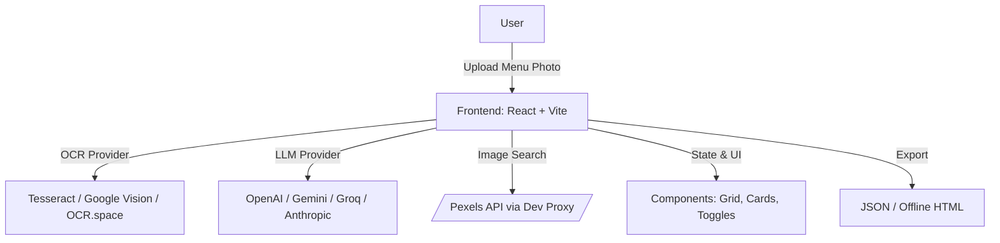

# MenuGenie — AI-Powered Menu Translation, Analysis, and Visualization

Turn any restaurant menu photo into a structured, translated, and visually rich digital menu — complete with ingredient highlights, dietary labels, confidence scores, and images.

## 🔍 Overview

- Transforms menu images into structured data using OCR + LLMs.
- Translates, simplifies, and explains dishes across 15+ languages.
- Highlights allergens, proteins, herbs/spices; classifies dietary suitability.
- Fetches dish images (real photos first, AI fallback conceptually).
- Exports results as JSON or offline HTML gallery.
- Works locally with Tesseract OCR by default; supports Google Vision and OCR.space.
- Pluggable LLM providers: OpenAI, Google (Gemini), Groq, Anthropic.

## 🧩 Problem, Solution & Impact

- **Problem Solved**: Foreign menus are confusing; dish names are opaque; dietary/allergen clarity is rare; travelers need fast, trustworthy understanding.
- **How It Solves It**: Combines OCR and LLMs to parse, translate, and enrich dish data; uses image search to visualize; displays confidence to communicate uncertainty.
- **Impact Created**: Reduces decision friction for travelers and dietary-restricted users; improves accessibility; enables integrations for hospitality and travel services.

---

## 📑 Table of Contents

- [📖 Project Title & Tagline](#menugenie--ai-powered-menu-translation-analysis-and-visualization)
- [🔍 Overview](#-overview)
- [🧩 Problem, Solution & Impact](#-problem-solution--impact)
- [✨ Features](#-features)
- [🎥 Demo](#-demo)
- [🌱 Origin](#-origin)
- [⚡ Quick Start](#-quick-start)
- [⚙️ Configuration](#-configuration)
- [🧭 Architecture](#-architecture)
- [🛣️ Future Roadmap & Potential Features](#️-future-roadmap--potential-features)
- [🔗 Comparable Projects](#-comparable-projects)
- [🧑‍🎓 Target Users & Use Cases](#-target-users--use-cases)
- [⚠️ Risks & Challenges](#-risks--challenges)
- [💰 Potential Monetization & Growth Ideas](#-potential-monetization--growth-ideas)
- [📂 Folder Structure](#-folder-structure)
- [🛠 Built With](#-built-with)
- [⚙️ Installation & Setup](#-installation--setup)
- [🧪 Testing](#-testing)
- [🚀 Deployment](#-deployment)
- [📡 API Endpoints](#-api-endpoints)
- [🐛 Known Issues](#-known-issues)
- [📊 Performance / Optimization (Optional)](#-performance--optimization-optional)
- [💡 Lovable Prompt](#-lovable-prompt)
- **🙏 Acknowledgments**
- [👤 Author](#-author)
- [📜 License](#-license)

---

## ✨ Features

- **For users**
  - ✅ Menu OCR and parsing (items, descriptions, prices, sections).
  - ✅ Instant translation and plain-language explanations.
  - ✅ Dietary labels: vegetarian, vegan, halal, kosher, pescatarian.
  - ✅ Allergen detection and ingredient highlights (e.g., shellfish, nuts).
  - ✅ Confidence scores to indicate reliability.
  - ✅ Food images: fetch real photos (Pexels) with proxy; AI fallback conceptually.
  - ✅ Export: JSON and offline HTML gallery.
  - ✅ Responsive UI; toggles for original text, nutrition hints, and max item count.

- **For developers**
  - ✅ Modular providers for OCR and LLMs (swap at runtime via env).
  - ✅ Image search proxy middleware to protect API keys during dev.
  - ✅ Caching, retry logic, and structured error handling.
  - ✅ TypeScript-first with clean separation of concerns.

## 🎥 Demo

- Live demo: add link here if available.
- How it feels: Upload a menu photo → watch progress steps (OCR → parse → enrich) → view a clean grid of dish cards with translations, labels, and photos.

## 🌱 Origin

- Inspired by Andrej Karpathy’s “vibe coding” project MenuGen — visualizing menus to make ordering intuitive for everyone.
- This project extends the idea: deeper parsing, multi-language translation, ingredient/allergen detection, dietary filters, and export options for practical use while traveling.

## ⚡ Quick Start

- Clone and run locally with default offline OCR (Tesseract) — no keys needed for basic parsing.
- Add API keys for LLMs, Google Vision/OCR.space, and Pexels to unlock full functionality.

```bash
git clone <your-repo-url>
cd MenuGenie
cp example.env .env   # set your keys
npm install
npm run dev
```

- Production build:
```bash
npm run build
npm run preview
```

## ⚙️ Configuration

Copy `example.env` → `.env`, then fill values:

```bash
# LLM Provider
VITE_LLM_DEFAULT_PROVIDER=openai  # openai | google | groq | anthropic
VITE_OPENAI_API_KEY=...
VITE_GOOGLE_LLM_API_KEY=...
VITE_GROQ_API_KEY=...
VITE_ANTHROPIC_API_KEY=...

# OCR Provider
VITE_OCR_DEFAULT_PROVIDER=tesseract  # tesseract | google-vision | ocr-space
VITE_GOOGLE_VISION_API_KEY=...
VITE_OCR_SPACE_API_KEY=...

# Images (Pexels)
VITE_PEXELS_API_KEY=...
PEXELS_API_KEY=...        # used by dev proxy middleware

# Optional: enable proxy during dev
# In code, proxy is used when import.meta.env.DEV or VITE_USE_IMAGE_PROXY === 'true'
VITE_USE_IMAGE_PROXY=true
```

- **Provider selection**: `VITE_LLM_DEFAULT_PROVIDER` and `VITE_OCR_DEFAULT_PROVIDER` determine default backends.
- **Security tip**: In production, move API calls server-side. The included Vite dev proxy only protects keys during local development.

## 🧭 Architecture

- Single-page app built with React + TypeScript and Vite.
- Pluggable providers for OCR and LLM services.
- Dev middleware proxies image search to Pexels to keep API key server-side during development.



### Core Flow

1. Upload image → OCR extracts text.
2. LLM parses items (name, description, price, section).
3. LLM translates, simplifies, classifies diet, flags allergens, estimates nutrition.
4. Image search fetches a representative dish photo.
5. UI displays cards; user toggles filters, original vs translated text, etc.
6. Export as JSON or offline HTML.

### Key Modules

- `src/services/ocr/*`: OCR providers and orchestration.
- `src/services/llm/*`: LLM provider factory and service.
- `src/services/apiService.ts`: Pexels image search with caching + retry.
- `imageProxy.ts`: Vite dev middleware for `/api/image-search`.
- `src/services/useMenuStore.ts`: App state store.
- `src/components/*`: UI components like `MenuUpload`, `MenuGrid`, `MenuCard`.

## 🛣️ Future Roadmap & Potential Features

- Voice pronunciation for dish names.
- Offline mode and on-device caching bundles.
- Favorites/history; collections.
- Public API (REST/GraphQL) for travel/hospitality integrations.
- Advanced nutrition estimates and macro breakdowns.
- Additional image sources and AI image generation fallback.

## 🔗 Comparable Projects

| Project | Key Features | How This Differs |
| --- | --- | --- |
| MenuGuide | OCR, translation, allergens, calories, pronunciation, images | Adds confidence rating; flexible provider architecture; export options |
| AnyMenu | Translation + order builder | Deeper ingredient/allergen analysis and dietary filters |
| Menu Translator App | Translate, explain, pronunciation, dietary tags | Two-stage image strategy + transparency via confidence scores |
| Google Lens / MS Translator | Real-time camera translation | Structured parsing, dietary/allergen intelligence, export |

## 🧑‍🎓 Target Users & Use Cases

- Travelers, expats, students abroad, foodies, and anyone with dietary restrictions or allergies.
- Use cases: decoding menus abroad, confirming diet compliance, avoiding allergens, understanding cultural context, sharing dish insights.

## ⚠️ Risks & Challenges

- OCR quality varies with lighting and layout; handwritten menus are hard.
- Ingredient lists can be incomplete; hidden allergens are a real risk.
- Nutrition is approximate; not medical advice.
- LLM translations can be ambiguous; confidence helps but doesn’t guarantee accuracy.
- Reliance on third-party APIs (limits, costs, availability).

## 💰 Potential Monetization & Growth Ideas

- Freemium: free basic usage; premium for offline, bulk scans, advanced nutrition.
- Partnerships: travel apps, language learning platforms, hospitality.
- B2B: white-label for hotels/airlines; API for partners.
- Community: open-source contributions; curated regional models.

## 📂 Folder Structure

```
.
├── src/
│   ├── components/
│   │   ├── ApiKeyManager.tsx
│   │   ├── DietaryIcons.tsx
│   │   ├── DietaryLabels.tsx
│   │   ├── ErrorBoundary.tsx
│   │   ├── FilterPanel.tsx
│   │   ├── HeroSection.tsx
│   │   ├── IngredientTranslations.tsx
│   │   ├── MenuCard.tsx
│   │   ├── MenuGrid.tsx
│   │   ├── MenuUpload.tsx
│   │   ├── OcrProgressDisplay.tsx
│   │   ├── OcrProviderSelector.tsx
│   │   ├── ProcessingStatus.tsx
│   │   ├── UnifiedApiManager.tsx
│   │   └── UploadedImageDisplay.tsx
│   ├── config/
│   │   ├── api.ts
│   │   ├── llmConfig.ts
│   │   └── ocrConfig.ts
│   ├── hooks/
│   │   └── useMenu.ts
│   ├── services/
│   │   ├── apiService.ts
│   │   ├── llm/
│   │   │   ├── llmProviderFactory.ts
│   │   │   └── providers/
│   │   │       ├── anthropicProvider.ts
│   │   │       ├── baseProvider.ts
│   │   │       ├── googleProvider.ts
│   │   │       ├── groqProvider.ts
│   │   │       └── openaiProvider.ts
│   │   ├── llmService.ts
│   │   ├── menuService.ts
│   │   ├── MenuUpload.tsx
│   │   ├── ocr/
│   │   │   ├── imagePreprocessor.ts
│   │   │   ├── ocrProviderFactory.ts
│   │   │   ├── ocrService.ts
│   │   │   └── providers/
│   │   │       ├── googleVisionProvider.ts
│   │   │       ├── ocrSpaceProvider.ts
│   │   │       └── tesseractProvider.ts
│   │   └── useMenuStore.ts
│   ├── types/
│   │   ├── llm.ts
│   │   ├── menu.ts
│   │   └── ocr.ts
│   ├── App.tsx
│   ├── index.css
│   ├── main.tsx
│   └── registerServices.ts
├── imageProxy.ts           # Vite dev middleware for /api/image-search
├── example.env             # Copy to .env and fill values
├── vite.config.ts
├── README.md
└── package.json
```

## 🛠 Built With

| Layer | Technology | Purpose |
| --- | --- | --- |
| Frontend | React, TypeScript, Vite, TailwindCSS | SPA, UI, DX |
| OCR | Tesseract.js, Google Vision, OCR.space | Text extraction from images |
| LLM | OpenAI, Google Gemini, Groq, Anthropic | Parsing, translation, enrichment |
| Images | Pexels API (via dev proxy) | Real dish images |
| Utilities | fetchWithRetry, CacheService, LoggingService | Reliability, caching, observability |
| Testing | Jest | Unit testing |
| Tooling | ESLint, PostCSS | Code quality and styles |

## ⚙️ Installation & Setup

- Prerequisites: Node 18+ recommended.

```bash
# 1) Install deps
npm install

# 2) Configure env
cp example.env .env
# Fill keys as needed (LLMs, Google Vision/OCR.space, Pexels)

# 3) Run dev
npm run dev

# 4) Build & preview
npm run build
npm run preview
```

- Windows, macOS, Linux are supported. No native dependencies required for default Tesseract mode.

## 🧪 Testing

```bash
npm test
```

- Uses Jest with `setupTests.ts`. Add tests alongside modules or in dedicated test files.

## 🚀 Deployment

- Static hosting (e.g., Vercel/Netlify) for the SPA build.
- For secure API usage in production, move provider calls server-side (Node/Edge functions).
- The included `imageProxy.ts` is for Vite dev only; implement a production proxy/endpoint to secure API keys.

## 📡 API Endpoints

Local dev proxy for Pexels (Vite middleware):

| Method | Endpoint | Description | Notes |
| --- | --- | --- | --- |
| GET | `/api/image-search?query=<text>` | Proxies image search to Pexels | Requires `PEXELS_API_KEY` or `VITE_PEXELS_API_KEY` set in environment |

Example client usage (auto-selects proxy during dev):
- In `src/services/apiService.ts`, the app uses `/api/image-search` if in dev or `VITE_USE_IMAGE_PROXY === 'true'`; otherwise it calls Pexels directly with `VITE_PEXELS_API_KEY`.

## 🐛 Known Issues

- Complex layouts, low-light, or handwritten menus degrade OCR performance.
- Some dishes/terms have ambiguous translations or no direct equivalents.
- Nutrition estimates are approximate; not a dietary authority.
- In production, you must move secret-bearing requests server-side.

## 📊 Performance / Optimization (Optional)

- Caching via `CacheService` for image URLs (24 hours by default).
- `fetchWithRetry` for transient error resilience and Pexels rate-limit handling.
- Query normalization reduces noisy image searches.
- Consider lazy-loading cards and progressive enhancement for large menus.

## 💡 Lovable Prompt

- “Build me a web app called MenuGenie. Users upload a restaurant menu photo. The app extracts items (OCR + AI), translates and explains dishes, highlights allergens and diet suitability, estimates nutrition, fetches dish images (real first, AI fallback), and displays a clean, responsive gallery. Include export to JSON and offline HTML; provide toggles for original text, allergens, nutrition, and max items.”

## 🙏 Acknowledgments

- Inspired by Andrej Karpathy’s MenuGen concept and “vibe coding” approach.
- Thanks to open-source communities around React, TypeScript, Vite, and OCR/LLM tooling.

## 👤 Author

- Karan Gupta

## 📜 License

- MIT License. See `LICENSE`.

